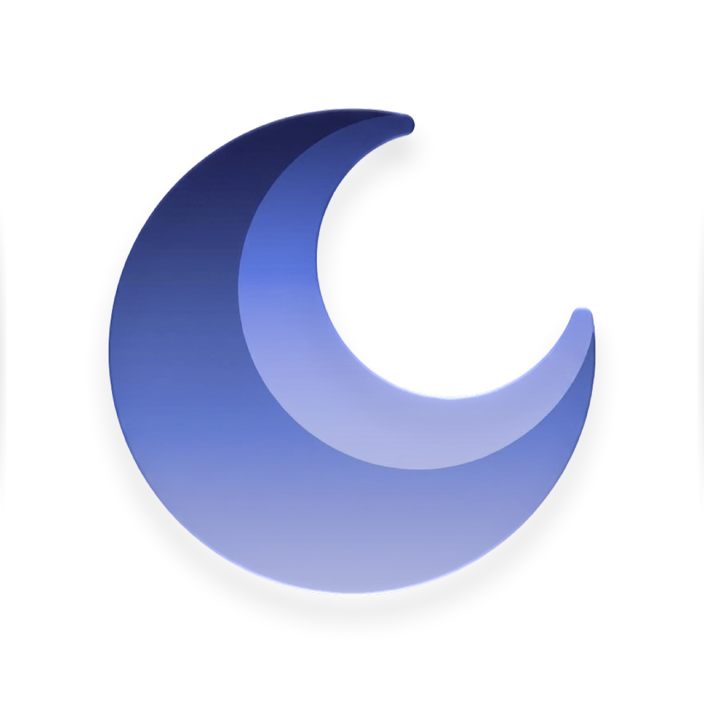

  
  <h1>Luna</h1>
  
<strong>Just the page.</strong>

  
A native WebKit browser for macOS.

 

  
  
  
  

> [!IMPORTANT]
> Luna is in planning. There is no app to build or run yet.
> [`TODO.md`](TODO.md) is the source of truth for scope and architecture.

## Overview

Luna is a macOS browser built with AppKit, SwiftUI, and WebKit. The project favours a quiet,
keyboard-driven interface that stays out of the way, rather than breadth of features.

## Repository

| Path | |
|---|---|
| [`TODO.md`](TODO.md) | The full specification |
| [`todo-board.html`](todo-board.html) | The same plan as a filterable board |
| `assets/icon/` | Icon sources and the exported `.icon` |
| `inspiration/` | Interface reference captures |

## Requirements

macOS 26+, Xcode 26+, Swift 6.

## Licence

Open source. Licence to be finalised.
