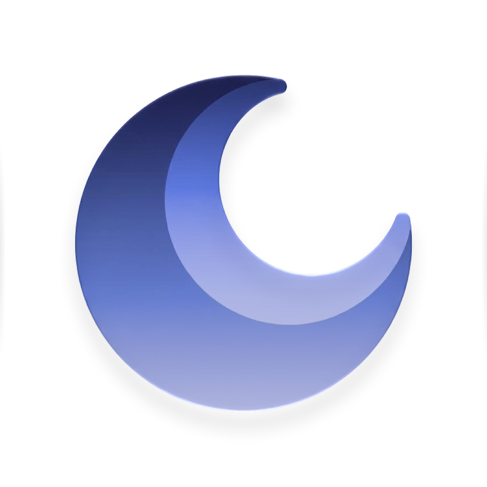

<div align="center">
  
  <h1>Luna</h1>
  <p><strong>Browse the dark side.</strong></p>
</div>
<p align="center">
  <a href="https://github.com/ziadmyassine/luna-browser/actions/workflows/ci.yml"></a>
  <a href="https://www.apple.com/macos/"></a>
  <a href="https://swift.org"></a>
  <a href="https://developer.apple.com/documentation/webkit"></a>
  <a href="https://github.com/users/ziadmyassine/projects/2"></a>
  <a href="LICENSE"></a>
</p>

Luna is a macOS browser built with AppKit and Apple's WebKit: one `WKWebView` per
tab, a Liquid Glass sidebar, and Spaces that keep your worlds apart. It favours a
quiet, keyboard-driven interface over breadth of features, and it has no account,
no server and no analytics.

## Highlights

- **Native macOS chrome** with a real Liquid Glass sidebar, or a top bar if you prefer
- **Spaces** on separate storage, so logins never cross; pinned tabs, folders and auto-archiving Today tabs
- **Command Bar** (`⌘T`): addresses, search, open tabs, history and commands in one field, and a tab switcher on `⌃⇥`
- **Chrome extensions** from the Chrome Web Store, with the permissions you grant
- **Reader and Markdown**: a clean reading view for articles, and `.md` files rendered, outlined and editable in the tab
- **Luna Control**: let an AI app (Claude, Codex, Cursor, VS Code) read and drive your tabs, with your approval
- **Astro** (`⌘E`), Luna's own agent in a panel beside the page, on your Claude or ChatGPT plan — in early development, with a lot of work still to do
- **Passwords** filled from the macOS Keychain behind Touch ID
- **Content blocking**, HTTPS-Only and per-site settings; hide anything on a page for good
- **Pinned tabs in Safari's Favorites**, so they follow you to Safari on the iPhone; iCloud sync of Spaces and tabs is on its way
- **Import** from Safari, Arc, Chrome, Brave, Edge and six more
- **Reduce Transparency, Increase Contrast and Reduce Motion** each designed, not degraded

## Download

Luna has no release yet. Build it from source below; releases will be signed and
notarised and appear on the [Releases](https://github.com/ziadmyassine/luna-browser/releases) page.

## Build from source

You need macOS 26 and Xcode 26.

```sh
git clone https://github.com/ziadmyassine/luna-browser.git
cd luna-browser
brew install xcodegen swiftlint
make gen    # generates Luna.xcodeproj from project.yml
make run
```

`make test`, `make lint` and `make check` run the tests and checks CI runs.
[CONTRIBUTING.md](CONTRIBUTING.md) has the rest: every make target, how work is
tracked, and the rules a change has to meet.

## Documentation

- [Architecture](docs/ARCHITECTURE.md): what Luna is, the layout of the repo, and how it fits together
- [Decisions](docs/DECISIONS.md): why it is built the way it is
- [Privacy](docs/PRIVACY.md): every way data leaves your Mac
- [FAQ](docs/FAQ.md): common questions and known issues
- [All docs](docs/README.md): the UI, Settings and Spaces specs, feature notes, plans and research
- [Changelog](CHANGELOG.md)

## Contributing

Everything planned, in progress and done is on the
[project board](https://github.com/users/ziadmyassine/projects/2). Bugs and ideas are
welcome as [issues](https://github.com/ziadmyassine/luna-browser/issues/new/choose);
security problems go through [SECURITY.md](SECURITY.md) instead. Please read the
[code of conduct](CODE_OF_CONDUCT.md).

## License

[GPL-3.0-or-later](LICENSE). The source of every released build has to be
available, in-app updates included.
